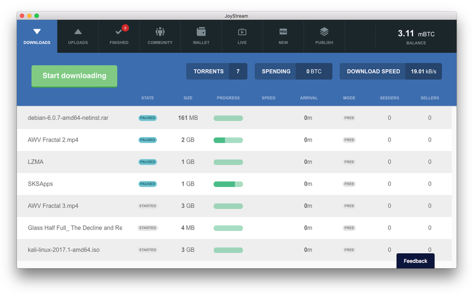

# JoyStream - desktop client

This is the main JoyStream cross platform (electron) desktop application, which currently works on Windows, OSX and Linux/Debian distros.



## License

FOSS - License ?

## Disclaimer

JoyStream is still in its early stages and may contain bugs. Use at your own risk.

## Download Binaries

You can download signed prebuilt binaries from the [Releases](https://github.com/JoyStream/joystream-electron/releases) section.

## Building

To build the application from source you will need to have a development setup on your system. The tools required are:
- [git](https://git-scm.com/)
- [node-js](https://nodejs.org)
- [node-gyp](https://github.com/nodejs/node-gyp)
- CMake (minimum version 3.1 for support of CMAKE_CXX_STANDARD variable)
- python2 + pip
- [Homebrew](https://brew.sh/)  - only for Mac
- [Conan](https://www.conan.io/downloads) C/C++ package manager

Follow [instruction in node-gyp readme](https://github.com/nodejs/node-gyp) for setting up a compiler toolchain for your platform.

Configuring conan:
```
# Add JoyStream conan repository
conan remote add joystream https://conan.joystream.co:9300 True

# Configure electron-rebuild to play nice with conan (see notes at end)
mkdir ~/.electron-gyp
ln -s ~/.conan ~/.electron-gyp/.conan
ln -s ~/.local ~/.electron-gyp/.local
```

Step-by-Step build instructions:
```
# Clone the repository
git clone https://github.com/JoyStream/joystream-electron.git
cd joystream-electron

# If building on windows install npm v4.6.1 (build fails with newer versions of npm)
npm install -g npm@4.6.1

# If building on OSX install openssl 1.0.x
brew install openssl

# Install dependencies and build c++ native libraries
npm install

# Rebuild native addons for electron framework and start the app
npm start
```

### Notes on electron-rebuild and conan
Electron-forge relies on electron-rebulid for rebuilding native addons.
electron-rebuild changes the HOME env variable to ~/.electron-gyp.

To use the same cache and configuration files a simple fix is to create a symbolic link:

```
mkdir -p ~/.electron-gyp
ln -s ~/.conan ~/.electron-gyp/.conan
```

Creating symbolic links on Windows (Enable Developer Mode on Windows 10) you can use the `mklink` command:

`mklink /J C:\Users\your_username\.electron-gyp\.conan C:\Users\your_username\.conan`

On Linux and OSX if you installed conan with `--user` argument to `pip` some python modules will be installed in `~./local` directory and will not be found when running conan through electron-rebuild and you may need to also create a symbolic link:

```
mkdir -p ~/.electron-gyp
ln -s ~/.local ~/.electron-gyp/.local
```
